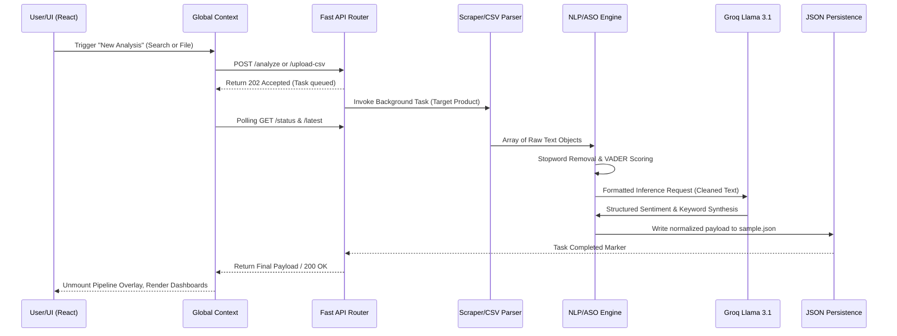

# Technical Data Flow and Workflow Documentation

This document explicitly defines the operational workflow, data lifecycle, and pipeline orchestration for the **Product Analyst** platform. It provides the technical specifications needed to present the system's runtime behavior.

## 1. System Architecture Data Flow

The application functions across three distinct processing zones: **Client State Handlers**, **API Gateway & Orchestration**, and **Data Persistence**.



## 2. Component Workflows

### A. Data Ingestion & Preprocessing Workflow
The system allows automated and manual data aggregation.
1. **Reddit Automated Scraper (`reddit_scraper.py`)** 
   - Uses `httpx` to fetch posts associated with the target product (e.g., "Asus ROG Strix G16").
   - Implements rotating `User-Agent` to bypass structural rate-limiting blocks.
   - Cleans response vectors by filtering out posts primarily composed of HTML tags or generic copy, preserving token limits.
2. **Manual CSV Intake (`main.py` -> `/upload-csv`)**
   - The user inputs proprietary datasets (via `pandas`).
   - The CSV processor determines the **Target Product** via the first column and maps subsequent headers as **Competitors**.
   - These parsed rows converge directly into the NLP pipeline, bypassing Reddit limits.

### B. Adaptive Sentiment Orchestration (ASO) Workflow
This pipeline mathematically determines emotional signatures rather than relying purely on LLM guesswork.
1. **Deterministic Baseline Check (VADER):** Calculates a compound polarity score (`-1.0` to `1.0`).
2. **Spectrum Bucket Sort:**
   - Scores `>= 0.6`: **Ultra Positive**
   - Scores `0.15` to `0.59`: **Positive**
   - Scores `-0.14` to `0.14`: **Neutral**
   - Scores `-0.59` to `-0.15`: **Negative**
   - Scores `<= -0.6`: **Ultra Negative**
3. **Sentiment Distribution:** Extends basic polarity with detected "community clusters" by parsing metadata strings (e.g., "Gamers", "Tech", "Professionals").

### C. Synthesis Workflow (LLM Inference)
Following extraction and scoring, the normalized arrays are injected into GroqCloud's Inference APIs.
1. **Prompt Injection:** Llama 3.1 Model processes the scored arrays against strict system prompts mandating specific JSON output keys.
2. **NLP Abstraction:**
   - Evaluates "Pain Points" vs "Positive Signals".
   - Identifies Sarcasm (flagged via contextual contradictions during inference).
   - Translates metrics into a finalized dataset array matching the `.json` schemas.

## 3. Data Contracts and Schema

The application establishes consensus between Server and Client via a strictly enforced JSON schema (defined via Pydantic).

**Final Processed Payload Schema (`sample.json` runtime structure):**
```json
{
  "stats": {
    "total": "Integer",
    "positive": "Integer",
    "negative": "Integer",
    "sarcastic_to_positive": "Integer",
    "sarcastic_to_negative": "Integer",
    "demographics": { "GEN Z (18-24)": "Integer", "...": "..." },
    "sentiment_spectrum": { "Ultra Negative": "Int", "...": "..." }
  },
  "dataset": [
    {
      "product": "String",
      "original_msg": "String",
      "sentiment": "String",
      "community": "String",
      "demographic": "String",
      "spectrum_score": "Float",
      "spectrum_bucket": "String",
      "date": "YYYY-MM-DD"
    }
  ],
  "_target_product": "String",
  "daily_timeline": { "YYYY-MM-DD": { "positive": "Int", "negative": "Int", "total": "Int" } }
}
```

## 4. Frontend State Machine (React Context)
The UI responds reactively to the pipeline state governed by `AnalysisContext.jsx`:
1. **`IDLE`**: User visits `StartPage`.
2. **`RUNNING`**: 
   - Polling loop starts (`setInterval` calling API).
   - Triggers Global Loading Overlay (`PipelineOverlay`).
   - Body overflow is hidden dynamically (locking scroll).
3. **`SUCCESS`**: 
   - Polling terminates.
   - Global raw payload sets derived states.
   - `IntelligenceDashboard` mounts `Recharts` using mapped data subsets (Clusters vs Spectrums).
4. **`ERROR`**:
   - Reverts state variables.
   - Renders Toast / Error boundary UI components containing raw Server exceptions.

## 5. Security & Isolation Workflow
- **Data Cross-Contamination Prevention**: The client restricts its UI visualizations directly against the `_target_product` attribute, ensuring that Competitor uploaded datasets do not skew the Donut Charts or Temporal Timelines intended solely for the Target Product.
- **Resource Management**: Server background tasks handle processing so HTTP responses do not bottleneck or drop out during high-latency LLM generations.
